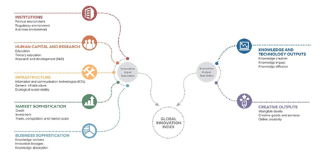

# Introduction 
An innovation is a new or improved product or process (or combination thereof) that differs significantly from the unit’s previous products or processes and that has been made available to potential users (product) or brought into use by the unit (process)[@olso2021]. Innovation Index is an appropriate measurement to gauge innovation capabilities. Innovation, being the most known ranking for measuring innovation performance is used as a leading reference in several international reports, for instance, the World Economic Forum’s Global Competitiveness Report which looks at economies’ innovation capability and ultimately, the Global Innovation Index which is co-published by the World Intellectual Property Organization, Cornell University and INSEAD. 

The aim of the GII is to provide insightful data on innovation and, in turn, to assist economies in evaluating their innovation performance and making informed innovation policy considerations. The GII relies on two sub-indices namely the Innovation Input Sub-Index (five pillars and captures the elements of the national economy that enable innovative activities) and the Innovation Output Sub-Index (two pillars and captures the result of innovation activities in an economy). The overall GII score is given by calculating the average of these input and output sub-indices.

Framework of the GII 2020 as follows [@cornell2020]:

This paper is structured as follows. Firstly, there will be an overview of the motivation of this research, followed by Review and Critic on Past Works in Section 3. Next, Section 4 presents an overview of the methodology. Following, the data set that was used in this research as well as the procedure of data manipulation is described in Section 5. A concise overview of the design framework is described in Section 6.  The interpretation of the analytics technique is presented in Section 7. Our results are visualized using R Shiny application in Section 8 and 9. Finally, future research direction are presented in the last section.

# Motivation

The purpose of this paper is to analyse and identify patterns regarding the GII during Covid-19 pandemic. We intend to draw conclusions from the data and generate visualization of the data for the respective countries or regions. Specifically, it will aim to answer the following questions:
i) Which country or region rank the highest or lowest during the pandemic?
ii)	How did country rank or score changes during pre and post pandemic?
iii) What is the main factor that impacts the GII Score more significantly during the pandemic?

# Review and Critic of Past Works

Based on the GII 2020 report, there are limitations in the exploration of relationship between the input and output sub-index. Current data visualization in the report only includes the relationship between innovation and development as shown below. For the purpose of our paper, we will look at the relationship between Institution, Human Capital and Research, Infrastructure, Market Sophistication, Business Sophistication, Knowledge and Technology outputs and Creative outputs.

# Methodology
The main parts of quantitative analysis will include Exploratory Data Analysis, Clustering, Statistical Plot and  Correlation.

Exploratory Data Analysis refers to the necessary process of performing initial investigations on the dataset to discover patterns and to gain more insights into the dataset and as part of pre-processing for further analysis.

Clustering is described as the unsupervised classification of patterns into groups, called clusters. One of the approaches is called Hierarchical clustering. 

Statistical Plot allows the visualization of the actual data in combination with a selection of summaries such as box plot or violin plot.

Lastly, it is important to look into correlations between chosen variables. The chart will show correlation coefficients between the GII score, innovation inputs and outputs.

# Data
The data was obtained from the official website of Global Innovation Index, representing for the year 2020. The data was collected for 131 countries, representing 93.5% of the world’s population and 97.4% of the world’s GDP in purchasing power parity current international dollars.

## Exploratory Data Analysis
The dataset was checked to ensure all variables have consistent naming convention. After removing the inconsistency, only dataset for year 2015 to 2020 was used.
Next, Data Wrangling involving extracting the score component of the dataset for each year, removing unwanted brackets from the score and pivoting the dataset to a longer dataset was done.
In order to achieve consistent country naming convention through the years, standardising country names using countrycode [@vincent2020] function in R packages is used.
Lastly, the naming convention of some indicators also differs from year to year. In order to achieve consistent indicators naming convention, the naming is aligned based on year 2020 according to the section number of each indicator.
Final dataset consists of 117 variables and 975 observations for year 2015 to 2020.

# Design Framework
The Shiny webpage will demonstrate the various features in a Shiny application, including interactive graphics and visualization. Our dashboard called **“INNOVAC” (INNOVation Amidst Covid-19)** has three separate modules namely Home, Exploratory Data Analysis and Statistical Analysis.

**Home** : Provides a board overview of the project and details of project team.
**Exploratory Data Analysis** : Provides users with 4 different exploratory techniques such as Choropleth Map, Radar, Chart, Slope Graph, and Bubble Plot (animated through years).
**Statistical Analysis** : Provides users with 3 different statistical techniques namely Correlation Analysis,       Statistical Plots (Violin, Box, and Scatter Plot), and Hierarchical Clustering (via a Heatmap).

# Analysis Technique  
  
  
## Choropleth Map
Choropleth Map is a thematic map in which areas are shaded in proportion to the GII score.  In the case of GII score, 6 bins were created, and sequential colour scheme (from light to dark blue) is used. Darker blue colour represents higher GII scores. 

## Radar Chart
Radar Chart displays multivariate data in a 2-dimensional chart where each variable starts at the same point.  In order to distinguish each observation from each other, only 10 countries (Top 10 rankings of the GII) were selected for further analysis.

## Slope Graph
In order to show the changes of GII score for all countries for year 2015 to 2020, Slope Graph is used. The chart will imply if there is a growing or declining trend across time period.

## Bubble Plot
It is important to visualize how input or output sub-index relate to one another. The use of Bubble Plot is an effective way to show the relationship between two variables. The advantage of a Bubble Plot allows the visualization of a third variable which is the size of the circle to reflect the GII score.

## Correlation Analysis
In our paper, we consider seven metric variables (Input and Output sub-indexes including Institution, Human Capital and Research, Infrastructure, Market Sophistication, Business Sophistication, Knowledge and Technology outputs and Creative outputs). Most of the correlation coefficient values appear positive. It provides users a measurement of the strength of association between the selected set of indicators.

## Statistical Plots
The statistical plots provide users with relevant statistical details via a combination of a scatter plot, box plot, and a violin plot.The plot is also publication-ready courtesy of the **ggstatsplot library**.

## Hierarchical Clustering
For visualizing multivariate data, heatmap [@tskam2019] is plotted with corresponding relationship and is also able to cluster similar countries and indicators together based on their relationships.

# Demonstration using Shiny
For a step-by-step guide on how to use the application, please refer to the Application User Guide:https://innovation-amidst-covid-19.netlify.app/posts/2021-04-25-application-user-guide/. 

The aim is to implement an interactive, user-friendly and scalable web-based application for analysing and visualization the data of Global Innovation Index 2020 with R and Shiny.

It can be seen from **Choropleth Map**, the GII scores varies for different countries. The map was rendered using the **tmap** package in R allowing to have more interactivity features in the dashboard like zooming, hovering over the country and GII score pops out respectively. By selecting particular indicator and year, user will be able to see the distribution of the GII scores in the geospatial view for all the countries. From the visualization, it becomes clear that countries like The United States have a higher GII score than Sub-Saharan Africa.

For **Radar Chart**, **ggplot2** helps render the chart into Shiny application.  By making use of Radar chart, it provides the breakdown of GII score based on seven indicators. In order to avoid too many overlays on a chart which may cause the chart to be complicated, our paper focuses on selected 10 countries as shown. In terms of interactivity, user is able to select from the side panel the Year of the data, the set of Indicators to compare, and the different Countries to compare among each other. 

For **Slope Graph**, the **newggslopegraph** package was exploited as it provides customizable slope graphs in terms of aesthetics and ease of usage. It allows the comparison of GII score for all countries across time periods (year 2015 to 2020). Different colours are used to show the trend of GII score for respective countries. From the visualization, there is a growing trend in GII score for China from year 2015 to 2019.
In terms of interactivity, user is able to select a range of Year, the Indicator to trend, and the set of Countries to compare among each other via the side panel.

The **Bubble Plot** below is an effective way to show the relationship between two variables. The bubbles are sized by GII score and interactive plot is rendered using **gganimate** [@gganimate2018] Package in R. From the visualization, the relationship between Ease of starting business and Gross expenditure on R&D is shown. Compared to other regions in Europe, Switzerland have the highest GII score. In terms of interactivity, user is able to select an indicator for all three different parameters: X-Axis, Y-Axis and Size of bubble as well as selecting the set of countries for comparison.

**Correlation** provides insights into the relationship between two variables. In this paper, we consider seven metric variables as shown. Correlation coefficient values ranges from -1 to +1 with 0 interpreted perfectly unrelated, -1 perfectly negatively related and +1 perfectly positively related.  Also, we measure three types of correlations namely Pearson correlation, Kendall rank correlation and Spearman correlation [@stats2018].

Pearson r correlation: Pearson r correlation is widely used in statistics to measure the degree of the relationship between linear related variables. 
Kendall rank correlation: Kendall rank correlation is a non-parametric test that measures the strength of dependence between two variables.
Spearman rank correlation: Spearman rank correlation is a non-parametric test that is used to measure the degree of association between two variables.

From the visualization, there is a high correlation between GII score and Knowledge and technology outputs.  The **corrplot** package was used to create the correlation plot.  In terms of interactivity, user is able to select the Year, the set of Indicators to correlate, filter the Countries, change the Correlation Method, change the Plot Method and Reorder the Correlation.

For **Statistical Plot**, a combination of box and violin plots with statistical details are included in the plot.
In terms of interactivity, user is able to select the different Years and the Indicator to compare among the different countries. 

For **Clustering**, **Heatmaply** package offers user friendly interactive cluster heatmap with tooltip display of values when hovering over cells. The user can calibrate the clustered heat maps by selecting year, number of clusters, indicators, linkage method (such as single linkage, complete linkage and average linkage) to visualize how different indicators contribute to GII score across different countries.  The various distance measures used are Euclidean, Maximum, Manhattan, Canberra, Binary and Minkowski.

# Results and Conclusion

From the above analysis, we can draw the following conclusion for the following key questions:
i)	Which country or region rank the highest or lowest during Covid-19 pandemic?
ii)	How did country rank or score changes during pre and post Covid-19 pandemic?

Based on the figures above, Switzerland ranks first among the other countries in 2020. Definitely, innovation financing declines in the current Covid-19 pandemic. It can be observed that higher innovation was observed when such countries had a less severe government response as opposed to lower innovation that was associated with countries with increased stringency.

Most countries experienced a decline in GII during the Covid-19 period in year 2020.

iii) What is the main factor that impacts the Global Innovation Score more significantly during Covid-19 pandemic?

The main factor as evident from the Correlation analysis is Knowledge and technology outputs. The Covid-19 pandemic has led to new international research collaborations especially in the area of healthcare.

# Future Works
Future research suggestions can be summarised as the following aspects:
i)	Finding suitable metrics that capture innovation for developing countries like Africa as innovation process is difficult partly due to uncertain domestic competencies.
ii)	Analysis from the Global Innovation Index can be done at a regional level instead of a specific country so as to achieve a comprehensive overview on the economy.

# Acknowledgements
We would like to show our gratitude to Professor Kam Tin Seong who provided insights and expertise that greatly assisted the project.

# References

---
references:
- id: olso2021
  title: Oslo Manual
  author: 
  - family: Organisation for Economic Cooperation and Development ilibrary
  type: article-journal
  publisher: Organisation for Economic Cooperation and Development (OECD)
  issued:
    year: 2021
    
- id: cornell2020
  title: Global Innovation Index 2020
  author: 
  - family: Cornell INSEAD WIPO
  type: article-journal
  publisher: Cornell INSEAD WIPO
  issued:
    year: 2020

- id: vincent2020
  title: Convert Country Names and Country Codes
  author: 
  - family: Vincent Arel-Bundock, CJ Yetman and Nils Enevoldsen
  type: article-journal
  issued:
    year: 2020

- id: tskam2019
  title: Heatmap Visualization with R
  author: 
  - family: Dr Kam Tin Seong
  type: article-journal
  issued:
    year: 2019

- id: gganimate2018
  title: Animated bubble chart with R and gganimate
  author: 
  - family: R graph gallery
  type: article-journal
  issued:
    year: 2018

- id: stats2018
  title: Advancement Through Clarity
  author: 
  - family: Statistics Solutions
  type: article-journal
  issued:
    year: 2018
    

...
