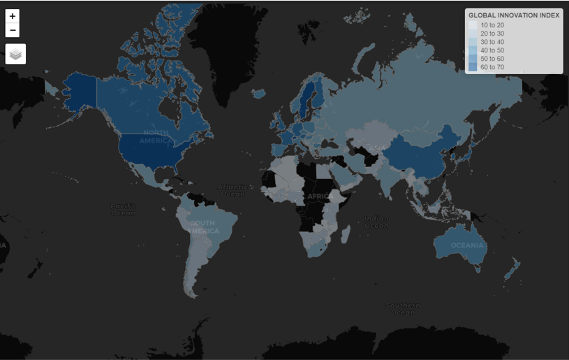
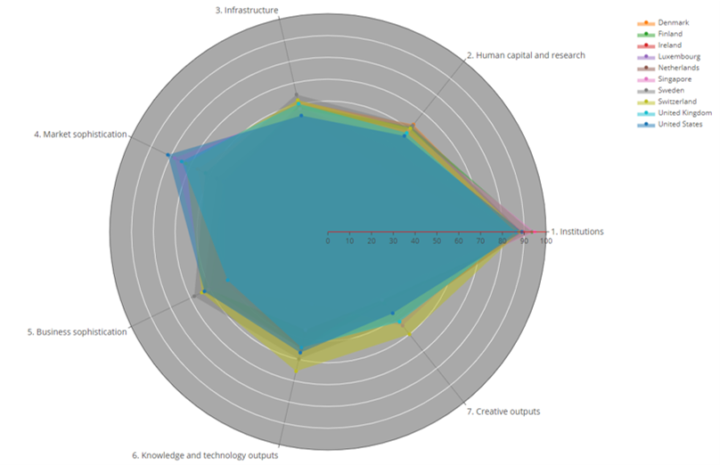
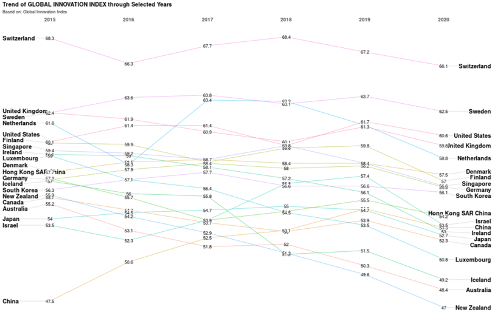
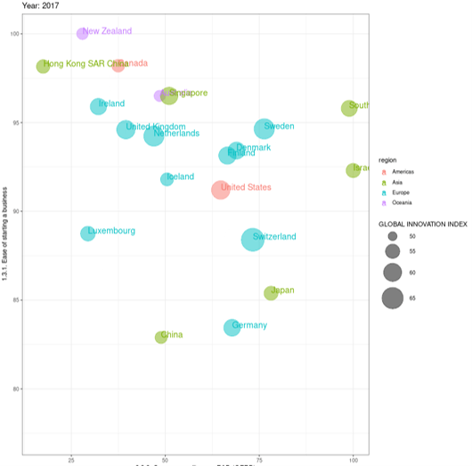
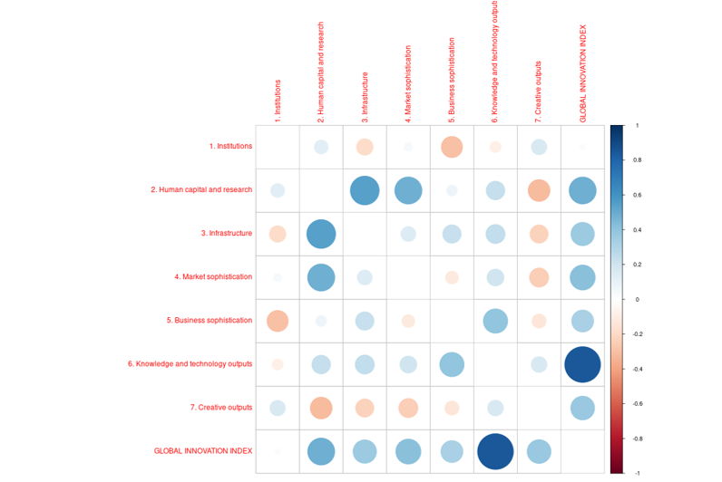
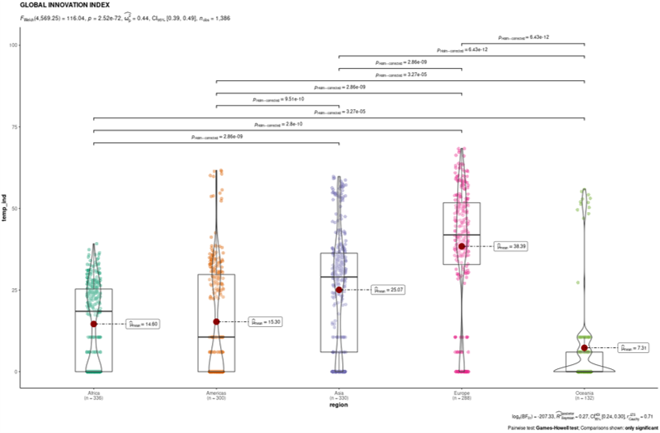
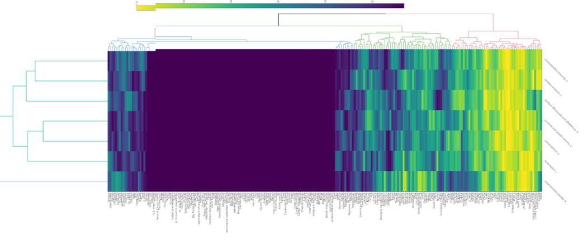
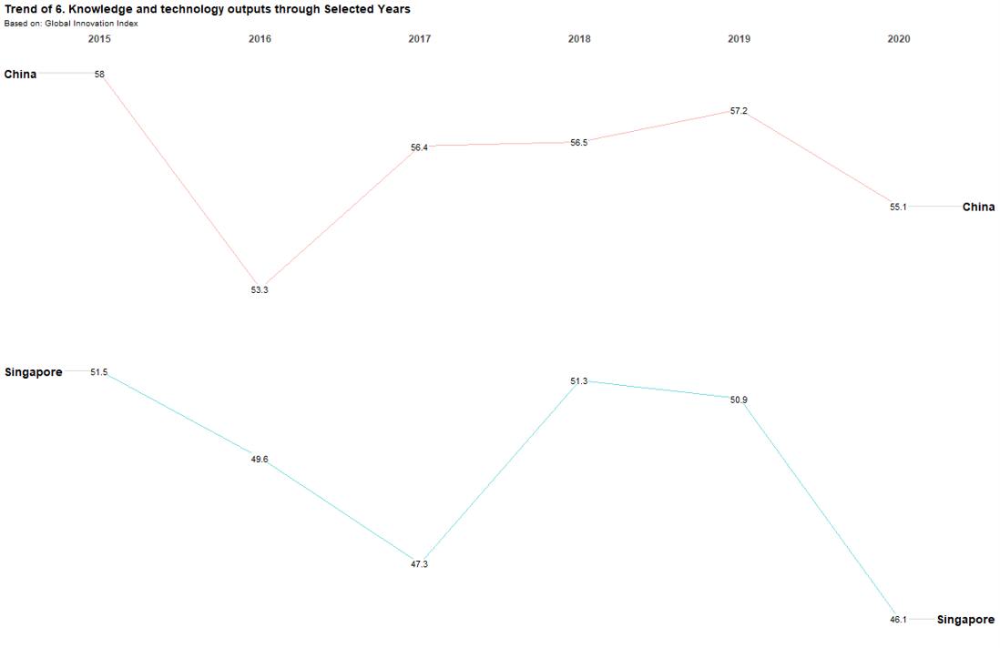

```{r setup, include=FALSE}
knitr::opts_chunk$set(echo = FALSE)

```

```{r echo=FALSE, eval=FALSE}

library(pagedown)
pagedown::chrome_print("Project-Poster.html")

```


# Introduction

An innovation is a new or improved product or process (or combination thereof) that differs significantly from the unit’s previous products or processes and that has been made available to potential users (product) or brought into use by the unit (process).  Innovation Index is an appropriate measurement to gauge innovation capabilities. Innovation, being the most known ranking for measuring innovation performance is used as a leading reference in several international reports, for instance, the World Economic Forum’s Global Competitiveness Report which looks at economies’ innovation capability and ultimately, the Global Innovation Index which is co-published by the World Intellectual Property Organization, Cornell University and INSEAD.

The purpose of this paper is to analyse and identify patterns regarding the **GII during Covid-19 pandemic**. We intend to draw conclusions from the data and generate visualization of the data for the respective countries.


# Approach

The main parts of quantitative analysis will include **Exploratory Data Analysis**, **Clustering**, **Statistical Plot** and **Correlation**.
Exploratory Data Analysis refers to the necessary process of performing initial investigations on the dataset to discover patterns and to gain more insights into the dataset and as part of pre-processing for further analysis.
Clustering is described as the unsupervised classification of patterns into groups, called clusters. One of the approaches is called **Hierarchical Clustering**. 

Statistical Plot allows the visualization of the actual data in combination with a selection of summaries such as box plot or violin plot.
Lastly, it is important to look into correlations between chosen variables. The chart will show correlation coefficients between the GII score, innovation inputs and outputs.

\

# Exploratory Data Analysis

### Choropleth Map
Choropleth Map is a thematic map in which areas are shaded in proportion to the GII score.  In the case of GII score, 6 bins were created, and sequential colour scheme (from light to dark blue) is used. Darker blue colour represents higher GII scores. 

{width="90%"}

### Radar Chart
Radar Chart displays multivariate data in a 2-dimensional chart where each variable starts at the same point.  In order to distinguish each observation from each other, only 10 countries (rank the top 10 of the GII Scores) were selected for further analysis.

{width="90%"}
\
\
\
\
\
\
\
\

### Slope Graph
In order to show the changes of GII score for all countries for year 2015 to 2020, Slope Graph is used. The chart will demonstrate if there is a growing or declining trend across time period.

{width="90%"}

### Bubble Plot
It is important to visualize how input or output sub-index relate to one another. The use of Bubble Plot is an effective way to show the relationship between two variables. The advantage of a Bubble Plot allows the visualization of a third variable which is the size of the circle to reflect the GII score.



# Statistical Analysis

### Correlation Analysis

In our paper, we consider seven metric variables (Input and Output sub-indexes including Institution, Human Capital and Research, Infrastructure, Market Sophistication, Business Sophistication, Knowledge and Technology outputs and Creative outputs). Most of the correlation coefficient values appear positive. It provides users a measurement of the strength of association between the selected set of indicators.



### Statistical Plots

The statistical plots provide users with relevant statistical details via a combination of a scatter plot, box plot, and a violin plot.The plot is also publication-ready courtesy of the ggstatsplot library.

{width="90%"}

### Hierarchical Clustering

For visualizing multivariate data, heatmap is plotted with corresponding relationship and is also able to cluster similar countries and indicators together based on their relationships.

{width="90%"}
\
\
\
\

# Results

* Most countries' innovation index reduced during the Covid-19 period in the year 2020 as seen from the Slope Graph. However, in terms of improvement, it can be seen that **China**'s innovation index has been increasing over the past few years.
* The main factor that is affecting the Global Innovation Index is **Knowledge and Technology Outputs**, which is probably rather obvious.
* It can also be concluded that the reason why China has increasing Global Innovation Index is because of increasing Knowledge and Technology Outputs.

{width="90%"}

* From the statistical plot shown earlier, it can also be concluded that **Europe** region generally has a higher Global Innovation Index as compared to the rest of the world. It is also interesting to see that **Americas** region and **Africa** region have similar average Global Innovation Index.

# Future Works

* Finding suitable metrics that capture innovation for developing countries like Africa as innovation process is difficult partly due to uncertain domestic competencies.
* Analysis from the Global Innovation Index can be done at a regional level instead of a specific country or economic so as to achieve a complete overview on the economy.

