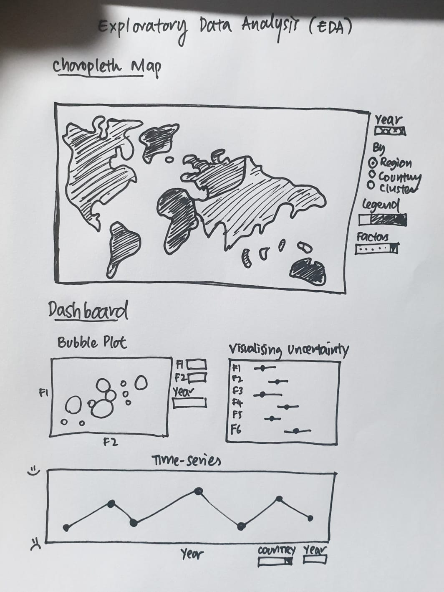
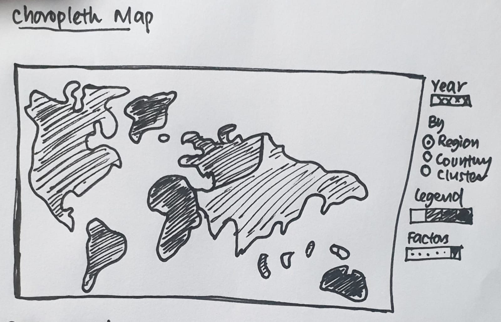
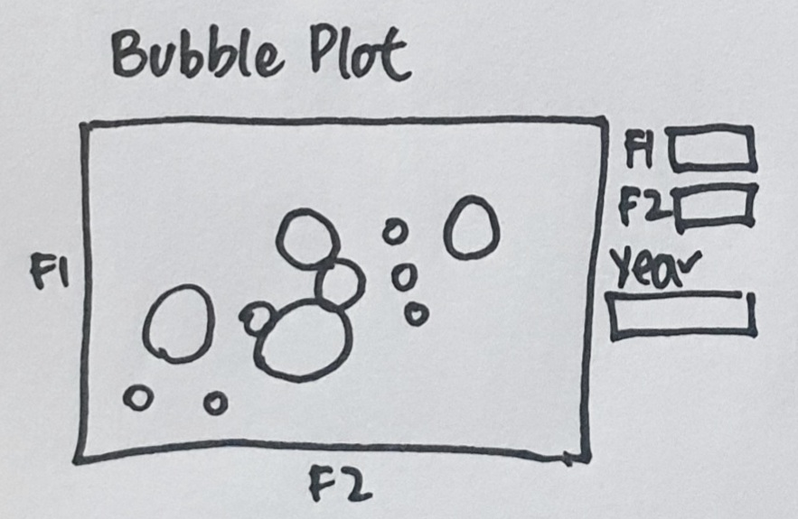
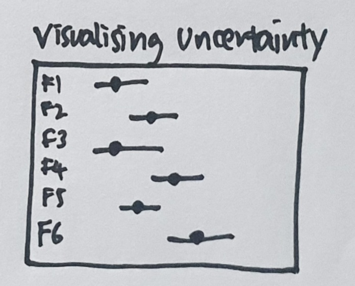
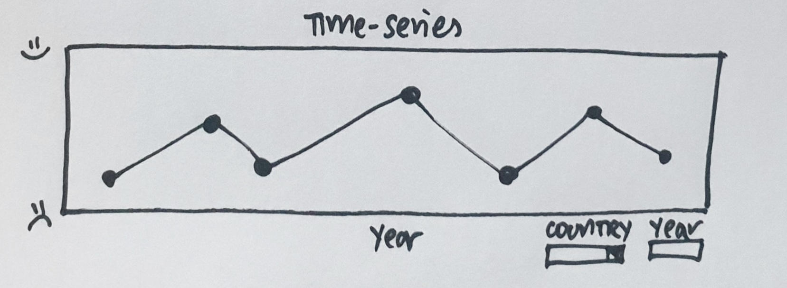
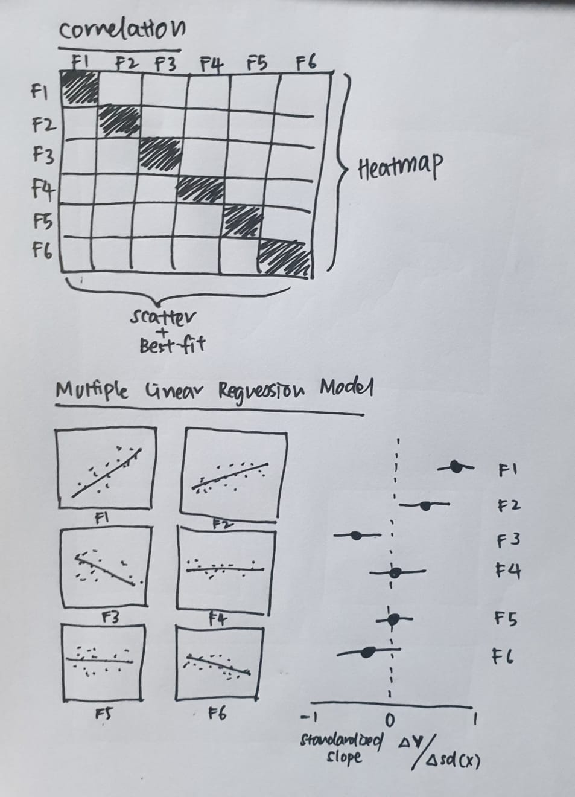
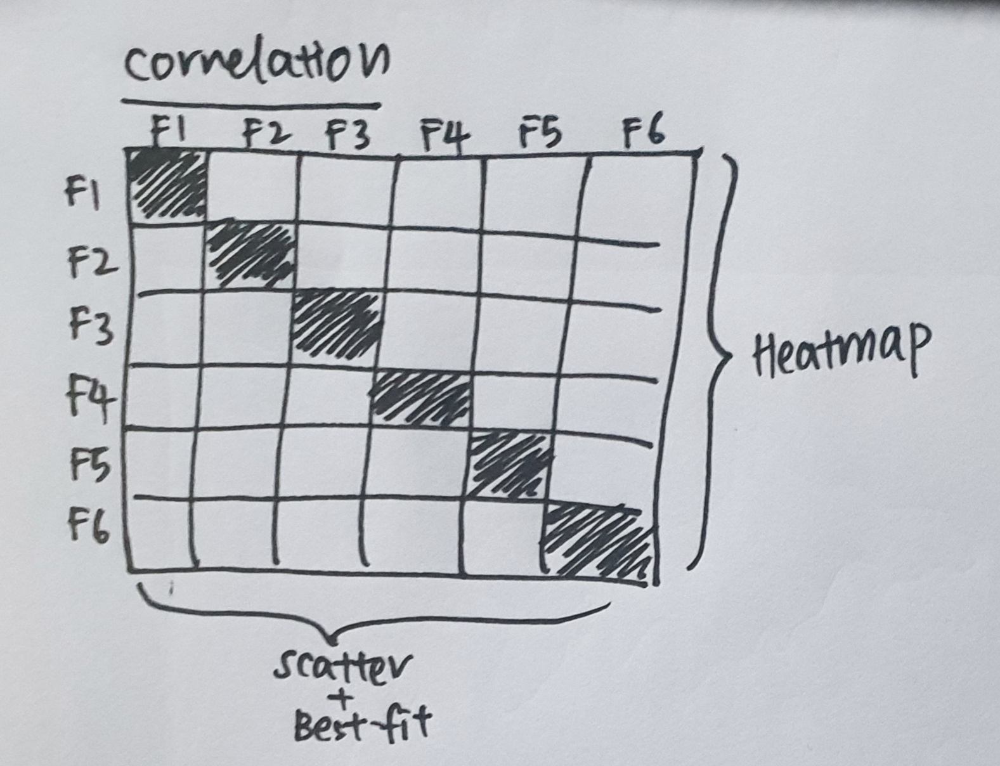
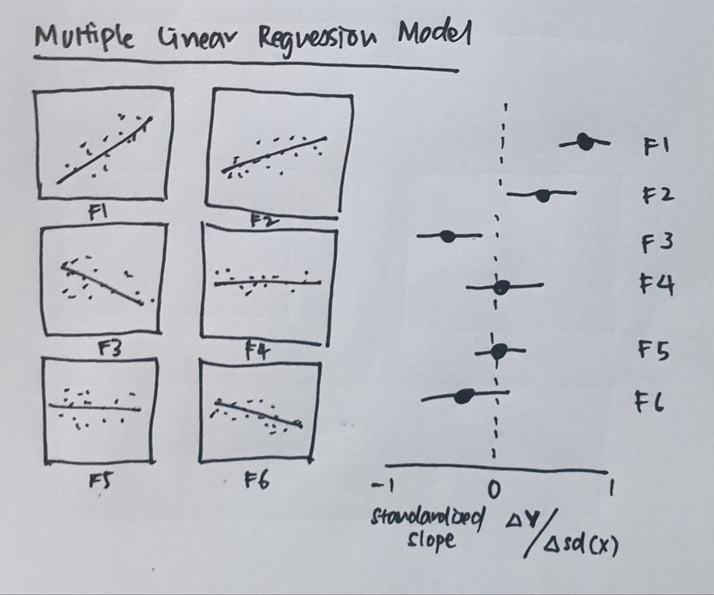
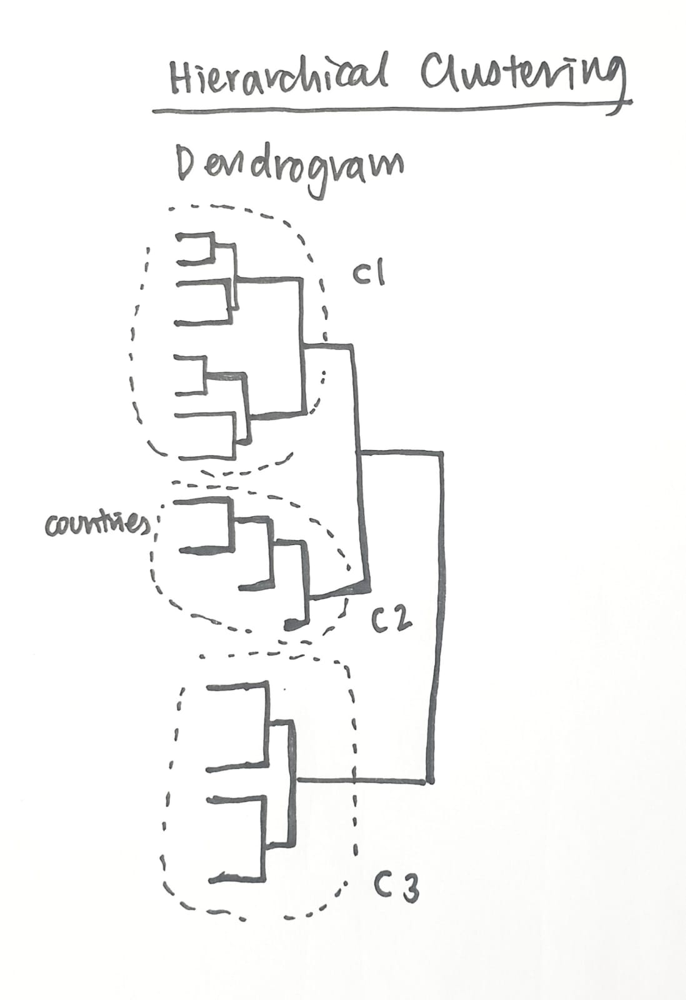

```{r setup, include=FALSE}
knitr::opts_chunk$set(echo = FALSE)
```

# Introduction

As the global Covid-19 pandemic hits, the theme of the Global Innovation Index (GII) 2020 is “Who will Finance Innovation,” which presents the current state and evolution of financial support mechanisms while exploring needed advances and remaining challenges.
The GII model includes 131 countries/economies, which represent 93.5% of the world’s population. The GII relies on two sub-indices – the Innovation Input Sub-Index and the Innovation Output Sub-Index. 

Three measures are calculated:
i)Innovation Input Sub-Index: Five input pillars capture elements of the national economy that enable innovative activities. The five pillars: Institutions, Human capital and research, Infrastructure, Market sophistication, and Business sophistication.
ii)Innovation Output Sub-Index: Innovation outputs are the result of innovative activities within the economy. Although the Output Sub-Index includes only two pillars, it has the same weight in calculating the overall GII scores as the Input Sub-Index. The two pillars: Knowledge and technology outputs and Creative outputs.
iii)The overall GII score is the average of the Input and Output Sub-Indices.

This project aims to analyse and identify patterns regarding the GII during Covid-19 pandemic.  We intend to draw conclusions from the data and generate visualization of the data for the respective countries or regions especially in Singapore.

# Motivation and Objectives

We have chosen to explore a dataset describing the Global Innovation Index. The index is a ranking of the innovation capabilities and results of world economies. The data set contains information of 131 countries based on Global Innovation Index 2020 report.

Our project aims to answer the following questions:    

1. Which country or region rank the highest/lowest during Covid-19 pandemic? 
2. How did country rank or score changes during pre and post Covid-19 pandemic?
3. What are the countries that experience a significant increase or decrease in Innovation index during Covid-19 pandemic?
4. What is the main factor that impacts the Global Innovation Score more significantly during Covid-19 pandemic?

# Methodology and Approach

## Data Source
https://www.globalinnovationindex.org/analysis-indicator

## Exploratory Data Analysis



### Choropleth Map



Analysis of Spatial Data: A Choropleth Map displaying the view of where each country is placed in the World ranking report (for example: darker shade for countries that have the highest rating while the lighter shade represents countries with a lower ranking). It will also be used to visualise the ranking for all the factors impacting the innovation index for individual countries, as well as for the region and clusters which will be determined by the hierarchical clustering later on.

### Bubble Plot



Multivariate graphical including Bubble Chart that displays multiple circles (bubbles) in a two-dimensional plot.

### Visualising Uncertainty



### Time-series Analysis



Identifying trends or patterns in the data over a time-period.

## Statistical Analysis



### Correlation Analysis



### Multi Linear Regression Model



To estimate the relationship between the various factors impacting the innovation index, and the innovation index.   

### Hierarchical Clustering



To understand how different countries relate to each other using the data provided, and how far apart data points are.
From there, we will be able to identify various clusters.

# Proposed R Packages

* **corrplot**: Visualisation of a Correlation Matrix
* **cluster**: Cluster Analysis
* **ExPanDar**: Explore Data Interactively
* **ggplot2**: Create Data Visualization
* **ggiraph**: Making ‘ggplot2’ Graphics Interactive
* **ggiraphExtra**: Make Interactive 'ggplot2'. Extension to 'ggplot2' and 'ggiraph'
* **RColorBrewer**: ColorBrewer Palettes
* **plm**: Linear Models for Panel Data
* **shiny**: Web Application Framework for R
* **tidyverse**: Install and Load the ‘Tidyverse’
* **tmap**: Thematic Maps


# References

* [Global Innovation Index](https://www.wipo.int/edocs/pubdocs/en/wipo_pub_gii_2020.pdfhttps://www.wipo.int/edocs/pubdocs/en/wipo_pub_gii_2020.pdf)


