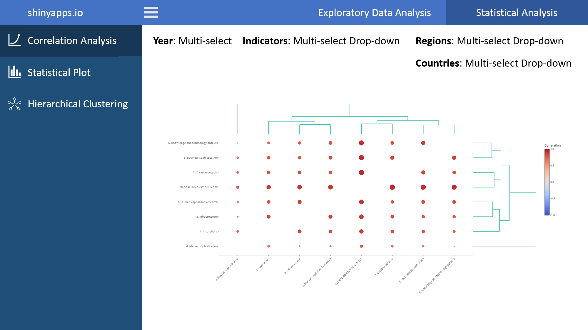
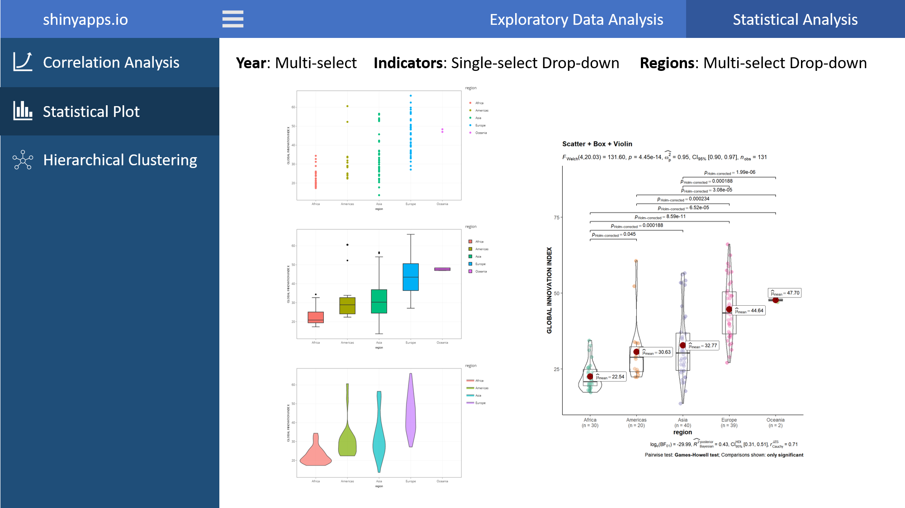
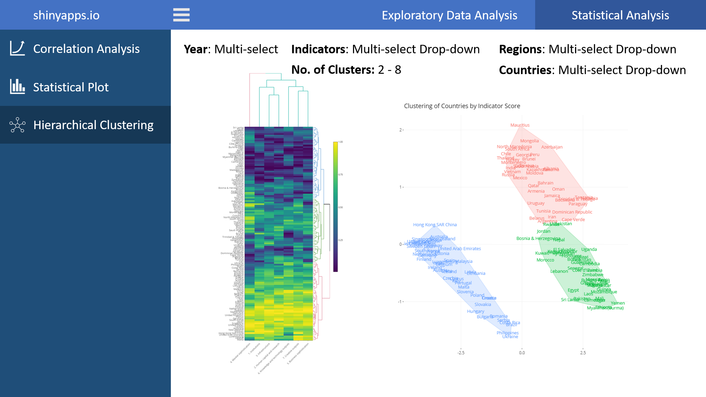

```{r setup, include=FALSE}
knitr::opts_chunk$set(echo = TRUE)
```

# How has Covid-19 affected innovations in Year 2020?


Ref: https://www.euroscience.org/news/science-policy-esof2020-innovation-in-times-of-covid-19/

## 1. Introduction

As the global Covid-19 pandemic hits, the theme of the Global Innovation Index (GII) 2020 is “Who will Finance Innovation,” which presents the current state and evolution of financial support mechanisms while exploring needed advances and remaining challenges. The GII model includes 131 countries/economies, which represent 93.5% of the world’s population. The GII relies on two sub-indices – the Innovation Input Sub-Index and the Innovation Output Sub-Index.

Our project aims to analyse and identify patterns regarding the GII during Covid-19 pandemic. We intend to draw conclusions from the data and generate visualization of the data for the respective countries or regions especially in Singapore.

For this particular report, I will be focusing on the statistical analysis of the GII data while my teammate, Elaine, will take care of the exploratory data analysis (EDA).

## 2. Loading the required packages
```{r message=FALSE, warning=FALSE}
packages = c('tidyverse', 'plotly', 'heatmaply', 'ggcorrplot',
             'dendextend', 'psych', 'stringr', 'countrycode',
             'factoextra', 'gridExtra', 'ggpubr', 'ggstatsplot')
for (p in packages){
  if(!require(p, character.only = T)){
    install.packages(p)
  }
  library(p, character.only = T)
}
```   

## 3. Data Source

The datasets are obtained from the [Global Innovation Index (GII) website](https://www.globalinnovationindex.org/home), which is co-published by Cornell University, INSEAD, and the World Intellectual Property Organization (WIPO), a specialized agency of the United Nations. The datasets can be downloaded from [HERE](https://www.globalinnovationindex.org/analysis-indicator).

For this particular project, we have downloaded full dataset in CSV for year 2013 to 2020. But we only used from year 2015 to 2020 due to inconsistency of the indicator naming convention in year 2013 and 2014.

## 4. Cleaning the Dataset for EDA and Statisical Analysis

The dataset consists of 7 main indicators and 101 sub-indicators which are used to compute the overall GII score. These indicators are represented as rows in the dataset. Each of the 131 different countries are represented as a column. Each indicator comes with 5 different parameters: Rank, Score, Value, Strength, and Weakness.

```{r warning=FALSE, paged.print=TRUE}

head(read_csv('data/2020.csv'))

```

For this project, we are only using the **Score** component of the dataset.

### 4.1 Global Variables

The start end and end year variables are going to be used throughout the data cleaning process, hence, we will set these as global variables.
As mentioned in the **Data Source** section, we are only using dataset from year 2015 to 2020 due to the inconsistent naming convention in year 2013 and 2014.

```{r}
start_year = 2015
end_year = 2020
```


### 4.2 Importing the Raw Dataset

We will load all the datasets from year 2015 to 2020 and dynamically assign them to a variable.

```{r message=FALSE, warning=FALSE}
for (year in start_year:end_year){
  var_name <- paste("year", year, sep = "_")
  assign(var_name, read_csv(paste("./data/", year, ".csv", sep = ""), na = "NA"))
}
```


### 4.3 Creating empty Dataframe for compiling dataframes

```{r}
score_compiled = data.frame()
gii_df = data.frame()
```


### 4.4 Data Wrangling 

We are going to 
1. Extract the Score component of the dataset for each year,
2. Remove unwanted brackets from the score,
3. Pivot the dataset to a longer dataset

Refer to the code below for more info.

```{r}

for (year in start_year:end_year){
  var_name_2 <- paste("score", year, sep = "_")
  year_df <- get(paste("year", year, sep = "_"))
  
  score_col = which(colnames(year_df)=="Score")
  value_col = which(colnames(year_df)=="Value")
  
  score <- year_df %>%
    select(c(1:2, (score_col+2):value_col-1)) %>% 
    slice(-c(1,6)) %>% 
    mutate(Indicator = X1) %>%
    select(-c(1:2)) %>%
    relocate(Indicator, .before = Albania_1)
  
  score[] <- lapply(score, gsub, pattern = "\\[", replacement = "")
  score[] <- lapply(score, gsub, pattern = "\\]", replacement = "")
  score[] <- lapply(score, gsub, pattern = "n/a", replacement = 0)
  
  score <- score %>% 
    type.convert %>%
    pivot_longer(cols = !Indicator, names_to = "Country", values_to = "Data") %>%
    mutate(Year = year, Category = "Score")
  
  score$Country <- substr(score$Country, 1, nchar(score$Country)-2)
  
  assign(var_name_2, score)
  
  score_compiled <- rbind(score_compiled, get(var_name_2))
}

```

Below is how the compiled score dataset looks like after data cleaning.

```{r}
head(score_compiled)
```


### 4.5 Standardising Country Names

Many of the country names are not consistent through the years. Hence, we need to standardise them so that the same country with different names would not be picked up as 2 different countries. For example, United States of America is named as "United States of America (the)" in year 2019 and year 2020 while named as "United States of America" from year 2015 to year 2018.

```{r}
score_compiled %>%
  select(Country, Year) %>%
  unique() %>%
  filter(str_detect(Country, "^United States"))
```

```{r}
unique_cty <- score_compiled %>%
  select(Country) %>%
  unique() %>%
  count()

print(paste("There are", unique_cty,"unique countries in the dataset BEFORE standardsing the country names."))
```
What we did is to assign a ISO3C country code to each country based on the best matched country code using the "countrycode" package and then using the ISO3C country code to generate a standardised country name. Some of the countries cannot be found in the ISO standard naming convention and thus, we used the original name in the dataset.

At the same time, we also differentiate the overall indicators by changing them to uppercase.

```{r message=FALSE, warning=FALSE}

gii_df <- score_compiled %>% 
  mutate(iso3c = countrycode(Country, origin = 'country.name', destination = 'iso3c')) %>%
  mutate(cty_name = countrycode(iso3c, origin = 'iso3c', destination = 'country.name.en' )) %>%
  mutate(Country = ifelse(is.na(cty_name), Country, cty_name)) %>%
  select(c(1:5)) %>%
  filter(Indicator != "Index") %>% 
  mutate(Indicator = str_to_upper(Indicator, locale = 'en'))

```

```{r}
unique_cty <- gii_df %>%
  select(Country) %>%
  unique() %>%
  count()

print(paste("There are", unique_cty,"unique countries in the dataset AFTER standardsing the country names."))
```

### 4.6 Standardising Indicators based on year 2020

The naming convention of some indicators also differs from year to year. To make the name of the indicators consistent, we will align the name of the indicator based on year 2020 according to the section number of each indicator.

```{r}

indicator_compiled = data.frame()

for (year in start_year:end_year){

  year_df <- get(paste("year", year, sep = "_"))
  
  indicator <- year_df %>%
    select(c(1:2)) %>%
    mutate(Year = year) %>%
    filter(X2 != "") %>%
    rename(Indicator = X1) %>%
    rename("Indicator Name" = X2)
  
  indicator_compiled <- rbind(indicator_compiled, indicator)

}

indicator_unique <- indicator_compiled %>%
  arrange(desc(Year)) %>%
  distinct(Indicator, .keep_all = TRUE) %>%
  select(c(1:2))

gii_df <- gii_df %>% 
  left_join(indicator_unique, by = "Indicator") %>%
  mutate(`Indicator Name` = replace_na(`Indicator Name`, "")) %>%
  mutate(Indicator = str_trim(paste(Indicator, `Indicator Name`, sep = " "))) %>%
  select(c(1:5))

```


### 4.7 Creating Wider Dataframe for Visualisation

For the purpose of visualisation such as bubble plots, we pivot the dataframe to a longer stucture with each indicator as a column.

```{r}

gii_df_wide_score <- gii_df %>%
  filter(Category == "Score") %>%
  pivot_wider(names_from = Indicator, values_from = Data)

```


Preview of the wider dataframe.

```{r}
head(gii_df_wide_score)
```


### 4.8 Export Cleaned Dataset for Sharing
```{r, echo=TRUE, eval=FALSE}

write_csv(gii_df, file = paste("./data/gii_dataset_",start_year,"-",end_year,".csv", sep = ""))
write_csv(gii_df_wide_score, file = paste("./data/gii_dataset_",start_year,"-",end_year,"_wide_score.csv", sep = ""))

```


## 5. Correlation Analysis

Since there are over 100 indicators, we are going to focus on the main 7 indicators in year 2020 for our statistical analysis.

The main 7 indicators are:

1. Institutions
2. Human capital and research
3. Infrastructure
4. Market sophistication
5. Business sophistication
6. Knowledge and technology outputs
7. Creative outputs


### 5.1 Data Wrangling for Correlation Analysis

We filter only the data in year 2020 and select the relevant columns. All the *NA* are replaced with 0.

```{r}
df <- gii_df_wide_score %>%
  filter(Year == 2020) %>%
  select(c("Country",
           "GLOBAL INNOVATION INDEX",
           "1. Institutions", 
           "2. Human capital and research",
           "3. Infrastructure",
           "4. Market sophistication",
           "5. Business sophistication",
           "6. Knowledge and technology outputs",
           "7. Creative outputs")) %>%
  replace(is.na(.), 0)

df <- column_to_rownames(df, var = "Country")

```

### 5.2 Static Correlation Plot between all the indicators in Year 2020

```{r}
pairs.panels(df, 
             method = "pearson", # correlation method
             hist.col = "#00AFBB",
             density = TRUE,  # show density plots
             ellipses = TRUE # show correlation ellipses
             )
```
From the correlation plot, all indicators are strongly correlated with the Global Innovation Index, with the lowest contributor being "Market sophistication" at 0.76. "Market sophistication" is also not so highly correlated with all of the other indicators.

```{r fig.height=8, fig.width=8}
cor.test.p <- function(x){
    FUN <- function(x, y) cor.test(x, y)[["p.value"]]
    z <- outer(
      colnames(x),
      colnames(x),
      Vectorize(function(i,j) FUN(x[,i], x[,j]))
    )
    dimnames(z) <- list(colnames(x), colnames(x))
    z
}

p <- cor.test.p(df)

  heatmaply_cor(cor(df),
                node_type = "scatter",
                point_size_mat = -log10(p),
                point_size_name = "-log10(p-value)",
                label_names = c("x", "y", "Correlation"),
                k_col = 2,
                k_row = 2)

```
The correlation can be seen more clearly with the heatmap above. For our project application, we will be using the above correlation plot since it is more interactive and easier to identify which is the higher correlated variable.

## 6. GII Score comparision on different continents

### 6.1 Data Wrangling to add Continent to Dataset
```{r message=FALSE, warning=FALSE}
gii_df_wide_score_continent <- gii_df_wide_score %>%
  mutate(region = countrycode(Country, origin = 'country.name.en', destination = 'un.region.name'))
```

### 6.2 Visualisation using Scatter Plot
```{r warning=FALSE}
gg1 <- ggplot(gii_df_wide_score_continent %>%
         filter(Year == 2020),
              aes(x=region,
                  y=`GLOBAL INNOVATION INDEX`,
                  color=region,
                  text = paste("Country:", Country)))+
  geom_point() + theme_bw() +
  theme(axis.title = element_text(family = "Helvetica", size = (8)))

ggplotly(gg1)
```

### 6.3 Visualisation using Box Plot
```{r}
gg2 <- ggplot(gii_df_wide_score_continent %>%
         filter(Year == 2020), 
         aes(x = region, y = `GLOBAL INNOVATION INDEX`)) +
  geom_boxplot(aes(fill=region)) + theme_bw() +
  theme(axis.title = element_text(family = "Helvetica", size = (8)))

ggplotly(gg2)
```

### 6.4 Visualisation using Violin Plot
```{r}
gg3 <- ggplot(gii_df_wide_score_continent %>%
         filter(Year == 2020),
         aes(x=region,y=`GLOBAL INNOVATION INDEX`))+
  geom_violin(aes(fill=region),alpha=0.7)+ theme_bw() +
  theme(axis.title = element_text(family = "Helvetica", size = (8)))

ggplotly(gg3)
```
### 6.5 Using ggstatplot for better comparison

```{r fig.height=8}
ggbetweenstats(
  data = gii_df_wide_score_continent %>%
         filter(Year == 2020),
  x = region, 
  y = `GLOBAL INNOVATION INDEX`, 
  title = 'Scatter + Box + Violin',
  type = 'parametric',
  conf.level = 0.95,
  pairwise.comparisons = TRUE,
  pairwise.display = 'significant', 
  p.adjust.method = 'holm', 
  ggtheme = ggplot2::theme_classic()
)

```
Since p-value is <0.05, we conclude that there is a significant difference between the GII score between the 5 different continents/regions.


## 7. Hierarchical Clustering

### 7.1 Data Wrangling for Clustering
```{r}
heatmap_indicator <- gii_df_wide_score %>%
  filter(Year == 2020) %>%
  select(c("Country",
           "1. Institutions", 
           "2. Human capital and research",
           "3. Infrastructure",
           "4. Market sophistication",
           "5. Business sophistication",
           "6. Knowledge and technology outputs",
           "7. Creative outputs")) %>%
  replace(is.na(.), 0) %>%
  column_to_rownames(var = "Country") %>%
  percentize()

```

### 7.2 Determining optimal number of clusters


```{r}
a <- fviz_nbclust(heatmap_indicator, hcut, method = "silhouette")
b <- fviz_nbclust(heatmap_indicator, hcut, method = "wss")+
    geom_vline(xintercept = 3, linetype = 2)
c <- fviz_nbclust(heatmap_indicator, hcut, method = "gap_stat")

grid.arrange(a,b,c)
```

Based on the 3 methods, the best bet is to use 2 or 3 as the optimal number of clusters.
For this project, we chose the optimal number of clusters to be 3.

### 7.3 Cluster by Main Indicators in Year 2020
```{r fig.height=18, fig.width=8}
heatmaply(heatmap_indicator, k_row = 3, k_col = 2,
  dist_method = "euclidean", hclust_method ="complete")
```
Interestingly, you can see that "Market sophistication" is clustered on its own from the rest of the indicators which is what we described during the correlation analysis. 

### 7.4 Visualising the clusters via a Cluster Map

Lastly, we visualise the different clusters via a cluster map. This allows us to interactively identify which countries are in which cluster.

```{r fig.height=8, fig.width=8}
heatmap_indicator_clus <- heatmap_indicator %>% 
  rownames_to_column(var = "Country") %>%
  mutate(cluster = cutree(hclust(dist(heatmap_indicator, method = "euclidean"), method = "complete"), k = 3)) %>%
  column_to_rownames(var = "Country")

clus_plot <- fviz_cluster(list(data = heatmap_indicator_clus, cluster = heatmap_indicator_clus$cluster),
                          geom = "text",
                          labelsize = 10,
                          show.clust.cent = FALSE,
                          main = "Clustering of Countries by Indicator Score",
                          legend = "none",
                          ggtheme = theme_minimal(),
                          xlab = FALSE,
                          ylab = FALSE)
ggplotly(clus_plot, tooltip = row.names(clus_plot))
```

## 8. Proposed Storyboard Design for Statistical Analysis of GII

### 8.1 Tab 1 - Correlation Analysis

The current correlation plot only consists of the 7 main indicators and only for year 2020. However, we have over 100 over sub-indicators for us to perform correlation analysis on and 6 years of data. Therefore, for our shiny app, we are going to allow users to interactively select:

1. Up to 20 indicators
2. Year
3. Regions
4. Countries



### 8.2 Tab 2 - Statistical Plot

The current statistical plot only focus on the GII score and does not involve any other indicators. Therefore, for our shiny app, we are going to allow users to interactively select:

1. 1 indicator
2. Year (multi-select)
3. Regions (multi-select)



### 8.3 Tab 3 - Hierarchical Clustering

The current hierarchical clustering only consists of the 7 main indicators for year 2020, and also fixed at 3 clusters. Therefore, for our shiny app, we are going to allow users to interactively select:

1. Up to 20 indicators
2. Year
3. Regions
4. Countries
5. No. of Clusters



## 9. Conclusion

Currently, all the graphs are limited by the current selection of variables and therefore, are not as useful for visual analytics. With the help of shiny and the interactiveness of plotly package, the proposed visualisation storyboard will be able to allow user to generate more insights from the GII dataset.

## References {.appendix}

* Global Innovation Index - https://www.globalinnovationindex.org/Home
* ggstatsplot - https://indrajeetpatil.github.io/ggstatsplot/articles/web_only/ggbetweenstats.html
* Plotly R Open Source Graphing Library - https://plotly.com/r/


