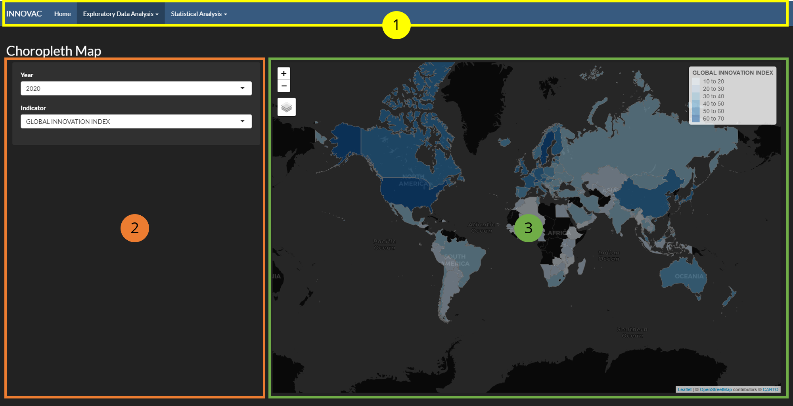
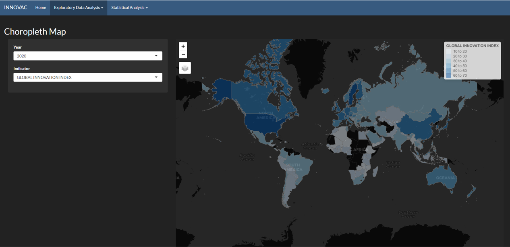
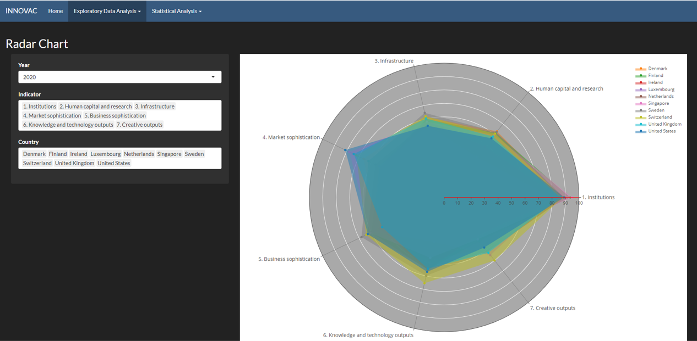
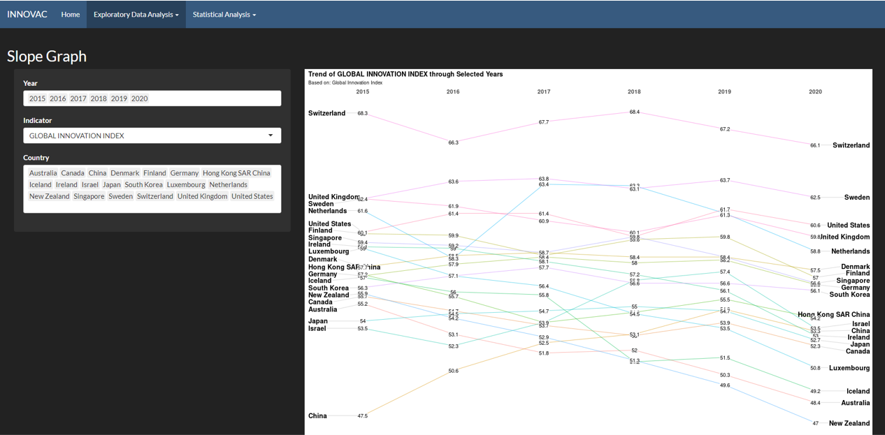
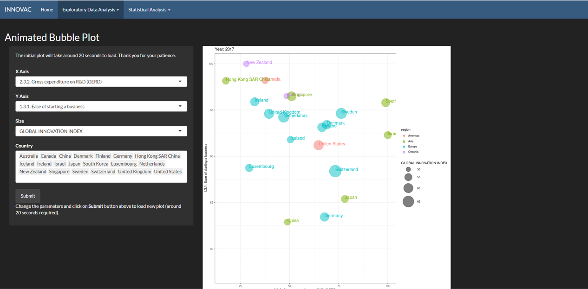
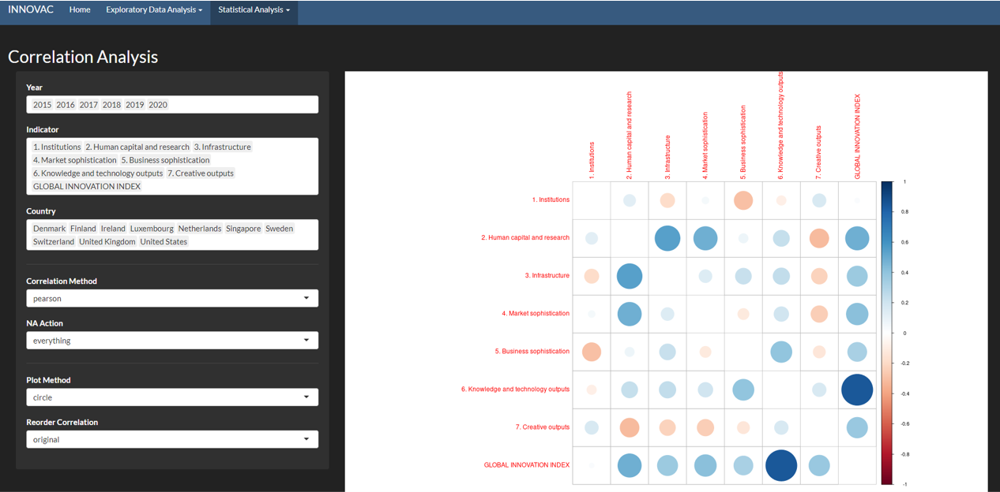
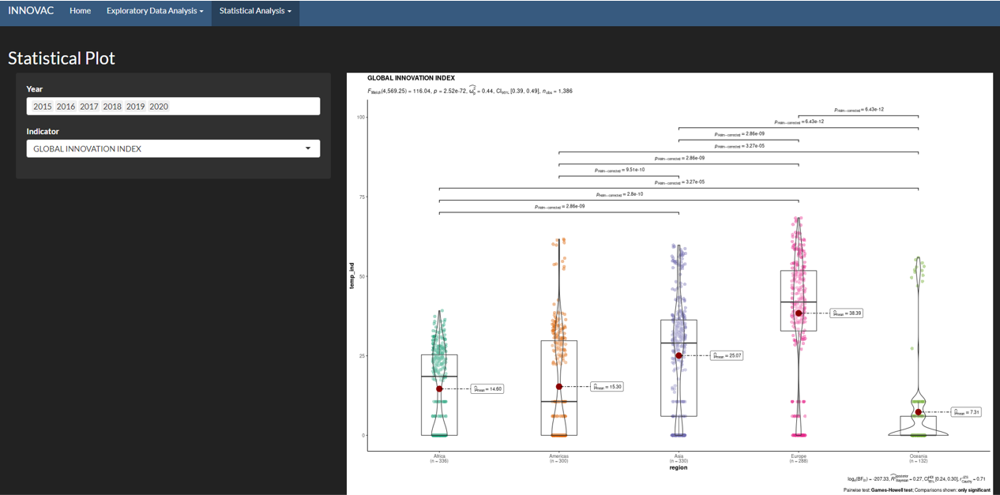
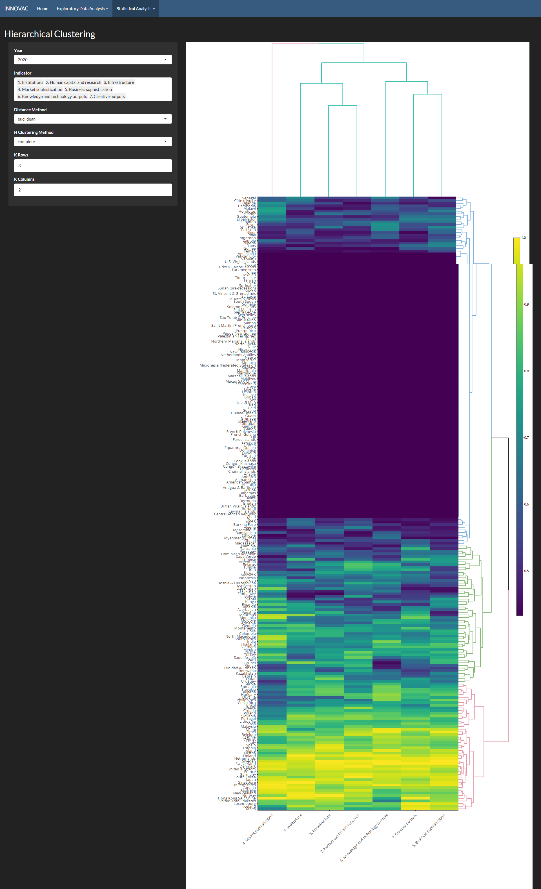

```{r setup, include=FALSE}
knitr::opts_chunk$set(echo = FALSE)
```

# Application User Guide

[Application Link](https://lanceteo89.shinyapps.io/INNOVAC/)

## Layout

The application has 3 main sections:

1. Top Navigation Bar
2. Side Panel
3. Main Panel

 

### Top Navigation Bar

The top navigation bar has 2 main sections with drop-down selections:

1. Exploratory Data Analysis

    * Choropleth Map
    * Radar Chart
    * Slope Graph
    * Bubble Plot

2. Statistical Analysis

    * Correlation Analysis
    * Statistical Plots
    * Hierarchical Clusting
  
### Side Panel

The side panel provides the various toggling parameters for different visualisation within the application.
Some might come with brief instructions on how to operation the application.

### Main Panel

The main panel is where the visualisation will be shown.

## Home - Landing Page of the Application

The landing page introduces the motivation of the projects and outline the contributors.

## Exploratory Data Analysis

The **Exploratory Data Analysis** module provides users with various tools to comb through the data and to obtain insights.

### Choropleth Map

 
The choropleth map provides a board overview and the spread of different indicators across the geospatial dimension.
User can select the **Year** and **Indicator** on the side panel to display on the world map.

The map is also interactive, hence, you will be able to zoom into the country that you are looking for.

### Radar Chart

 

The radar chart provides a comparison between different selected countries based on the selected set of indicators.
User can select from the side panel the **Year** of the data, the set of **Indicators** to compare, and the different **Countries** to compare among each other.

An overlay will be added for each country.

### Slope Graph

 

The slope graph provides a time-series analysis and comparison of the selected indicator for select set of countries.

Users can select a range of **Year**, the **Indicator** to trend, and the set of **Countries** to compare among each other via the side panel.

### Bubble Plot

 
*Note: the bubble plot is animated and therefore, the initial plot and subsequent plot (via Submit button) takes around 20 seconds to load*

The bubble plot provides the relationship between the 3 selected indicators for each of the country. An animation is also added to look at the changes for the 3 selected indicators across the years (from 2015 to 2020).

Users can choose an indicator for the 3 different parameters: **X-Axis**, **Y-Axis**, and **Size** of the bubble, and also choose the set of **Countries** to compare among each other.


## Statistical Analysis

The **Statistical Analysis** module provides users with various statistical techniques to deep dive into the dataset and uncovering hidden patterns and trends.

### Correlation Analysis

 
The correlation plot provides users a measurement of the strength of association between the selected set of indicators.

Users are able to select the **Year**, the set of **Indicators** to correlate, filter the **Countries**, change the **Correlation Method**, the way NA is handles via **NA Actions**, the **Plot Method** and how the correlation is orders via **Reorder Correlation**.


### Statistical Plots

 

The statistical plots provides users with relevant statistical details via a combination of a scatter plot, box plot, and a violin plot.
The plot is also *publication-ready* courtesy of the *ggstatsplot* library.

Users are able to select the different **Years** and the **Indicator** to compare among the different regions.

### Hierarchical Clustering

 
Hierarchical Clustering allows users to cluster similar countries together via the selected indicator in the selected year.

Users are able to select the **Year** of interest, the set of **Indicators** for clustering, the **Distance Method** used, the **Hierarchical Clustering Method**, the number of **Clusters** for the countries and indicators.


